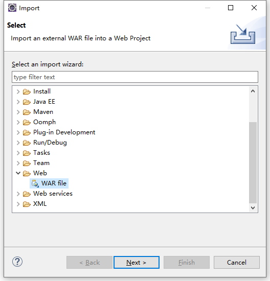
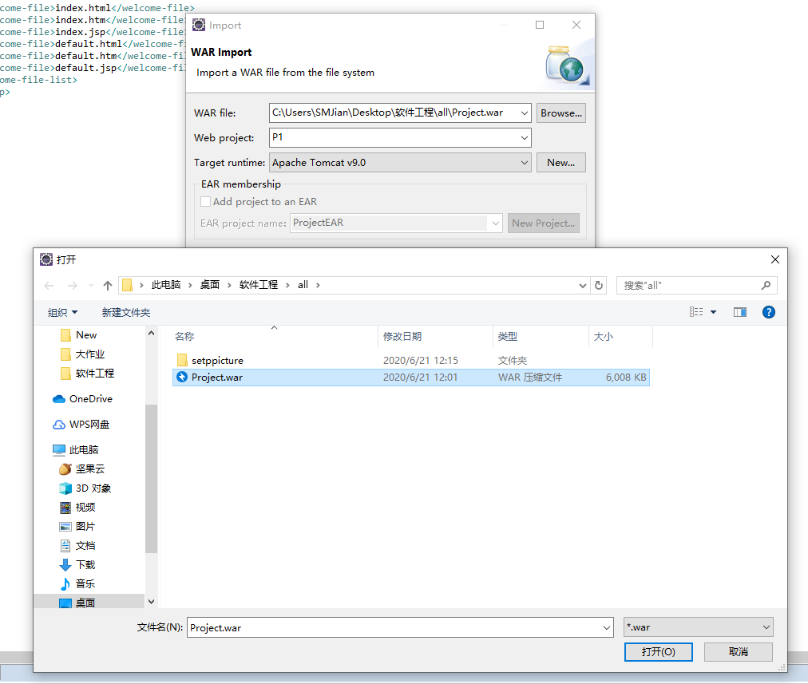

# 网上商城系统
环境配置
>1、 Eclipse IDE for Enterprise Java Developers - 2019-12  
>2、Java JDK 8  
>3、Tomcat 9.0  

1、进入Eclipse主界面    
File->Import    
    
Web->WAR file->Next
    
Brow..选择Project.war   
Target runtime选择Apache Tomcat v9.0
    
最后Finish就行  
主页面为index.jsp   
登录为login.jsp